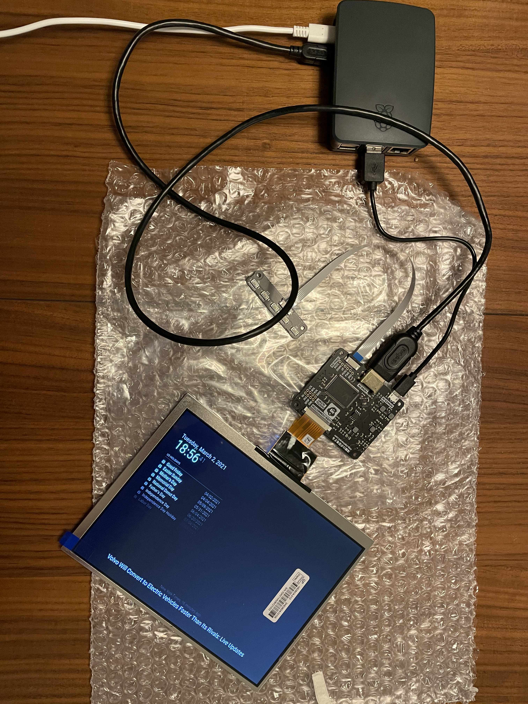

# My Magic Mirror

## Parts

- [x] Raspberry PI (with power supply and so on)
- [x] Some kind of display (probably https://shop.pimoroni.com/products/hdmi-8-lcd-screen-kit-1024x768)
- [x] Display connector (Micro HDMI to *something*),
- [ ] Wood for the frame
- [ ] Mirror. Either:
  - Glass with mirror foil
  - Two-way mirror

## Software

- [x] https://magicmirror.builders

MagicMirror² seems to be easy enough, and give a good result. There also exists a ton of modules.

## Log

### 02.03.2021

Assembled the display (display, display driver board, display control board, and cables), and connected it to the Raspberry PI with a USB cable and a HDMI cable. The display is powered with 5V from the USB, so only one power cable is needed in total.

### 01.03.2021

Display received by mail.

### 17.02.2021

Finally ordered display from Pimoroni.

### 14.02.2021

Hardly a session, but I spent some time looking for a display. After a lot of thinking, I want a small display that can use the Raspberry PI as a power source. Several exists, but most of them are touchscreens. Which would be a complete waste.

I will probably order https://shop.pimoroni.com/products/hdmi-8-lcd-screen-kit-1024x768 – an 8 inch display powered by USB. It also has a decent resolution – more than enough to display some text.

### 11.02.2021

Research day. Set up a parts list over some of the things needed to get this going. Finally decided to build a small mirror instead of a larger one so the display can draw power from the PI itself.

Also got hold of a UBS keyboard (only have the wireless ones at home!) and a micro HDMI connector. Got the PI booted and set up. Installed the magicmirror.builders software without trouble and booted the default config.

### 04.02.2021

Got my Raspberry PI kit in the mail. Also bought a Sunfounder kit with a bread board and a few parts.
